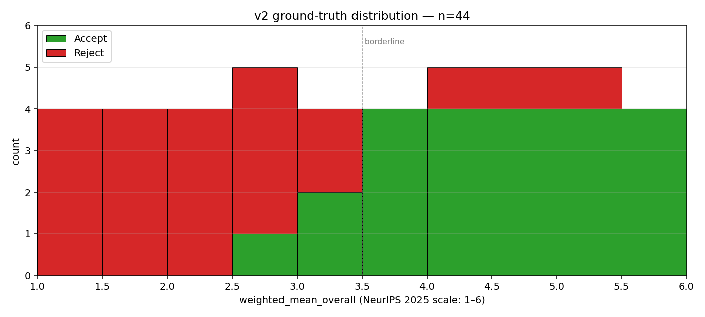
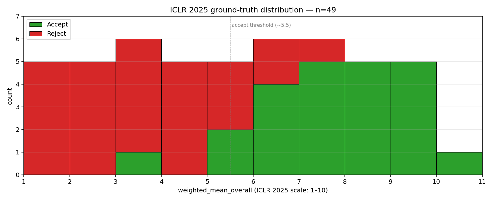

# Blind Paper Review Dataset for AI Judge Evaluation

Curated, blinded datasets of recent ML conference papers for evaluating AI scientific reviewers.
Each paper ships with the original PDF, a sanitized (author-blind) PDF, full review records,
and ground-truth labels for the prediction task.

**Venues included:**
- NeurIPS 2025 (`neurips-2025-dataset-v2/`) — 44 papers
- ICLR 2025 (`iclr-2025-dataset/`) — 49 papers

## Prediction task

Given a blinded paper, predict what human reviewers concluded:

```json
{
  "paper_id": "...",
  "predicted_weighted_mean_overall": 4.13,
  "predicted_accept": true
}
```

- `weighted_mean_overall` — continuous, confidence-weighted mean of reviewer overall scores. **Scale differs by venue** (see below).
- `accept` — binary, from the final decision note (any "Accept *" tier → true).

See `brainstorm-ideas-dataset/2-claude_brainstorm_v1.md` for the full target spec.

## Datasets

### NeurIPS 2025 (`neurips-2025-dataset-v2/`)

44 papers. Rating scale **1–6**, confidence 1–5.

- 40 papers: 4 per 0.5-wide bin × 10 bins across the 1–6 scale
- 4 mismatch papers: 1 low-score accept (wmean<3.0) + 1 high-score reject per bin in [4.0–5.5)



### ICLR 2025 (`iclr-2025-dataset/`)

49 papers. Rating scale **1–10**, confidence 1–5. Same target shape, different scale.

- 45 papers: 5 per 1.0-wide bin × 9 bins (`[1,2)` through `[9,10)`)
- 1 paper from `[10,10]` (the only one in the venue)
- 3 mismatch papers: 1 low-score accept + 1 high-score reject per bin in [6,7) and [7,8)



Mismatch papers are flagged with `mismatch: true` in their meta.json.

## Layout (per dataset)

```
<venue>-dataset/
├── papers/                       # original PDFs + per-paper metadata
├── sanitized-papers/             # blinded PDFs (author identity removed)
├── open-reviews-raw/             # full review records from OpenReview
├── open-reviews-quantized/       # normalized review JSONs (scores only)
├── open-reviews-ground_truth/    # minimal ground-truth blob per paper
└── _cache/                       # selection cache + selection.json
```

## Sanitization

Each sanitized PDF has:
- Title-page author block redacted
- All author names (and variants ≥4 chars) redacted across body
- Emails, ORCIDs, GitHub/lab URLs, arXiv-ID footnotes redacted
- Acknowledgments / Author Contributions / Funding sections redacted
- All link annotations stripped (clickable URI metadata removed)
- PDF metadata blanked

An aggressive audit pass (`scripts/sanitization/sanity_check.py <dataset-dir>`)
runs against each PDF and flags any residual leakage.
Current status: **0 FAILs across 93 papers** (44 NeurIPS + 49 ICLR).

## Scripts

### Builders
- `scripts/build.py` — NeurIPS 2025 builder
- `scripts/build_iclr.py` — ICLR 2025 builder
- `scripts/add_mismatches.py` / `scripts/trim_mismatches.py` — NeurIPS mismatch tooling

### Verification + audit
- `scripts/verify_dataset.py` — NeurIPS integrity check
- `scripts/verify_iclr.py` — ICLR integrity check
- `scripts/sanitization/sanity_check.py [dataset-dir]` — blind-review leak audit
- `scripts/sanitization/fix_sanitization.py` — idempotent post-process

### Plots
- `scripts/plot.py` — NeurIPS ground-truth distribution
- `scripts/plot_iclr.py` — ICLR ground-truth distribution

## Setup

```bash
python3 -m venv .venv
.venv/bin/pip install openreview-py pymupdf requests matplotlib
```

## Source

All papers and reviews from [OpenReview](https://openreview.net/):
- NeurIPS 2025: `NeurIPS.cc/2025/Conference`
- ICLR 2025: `ICLR.cc/2025/Conference`
